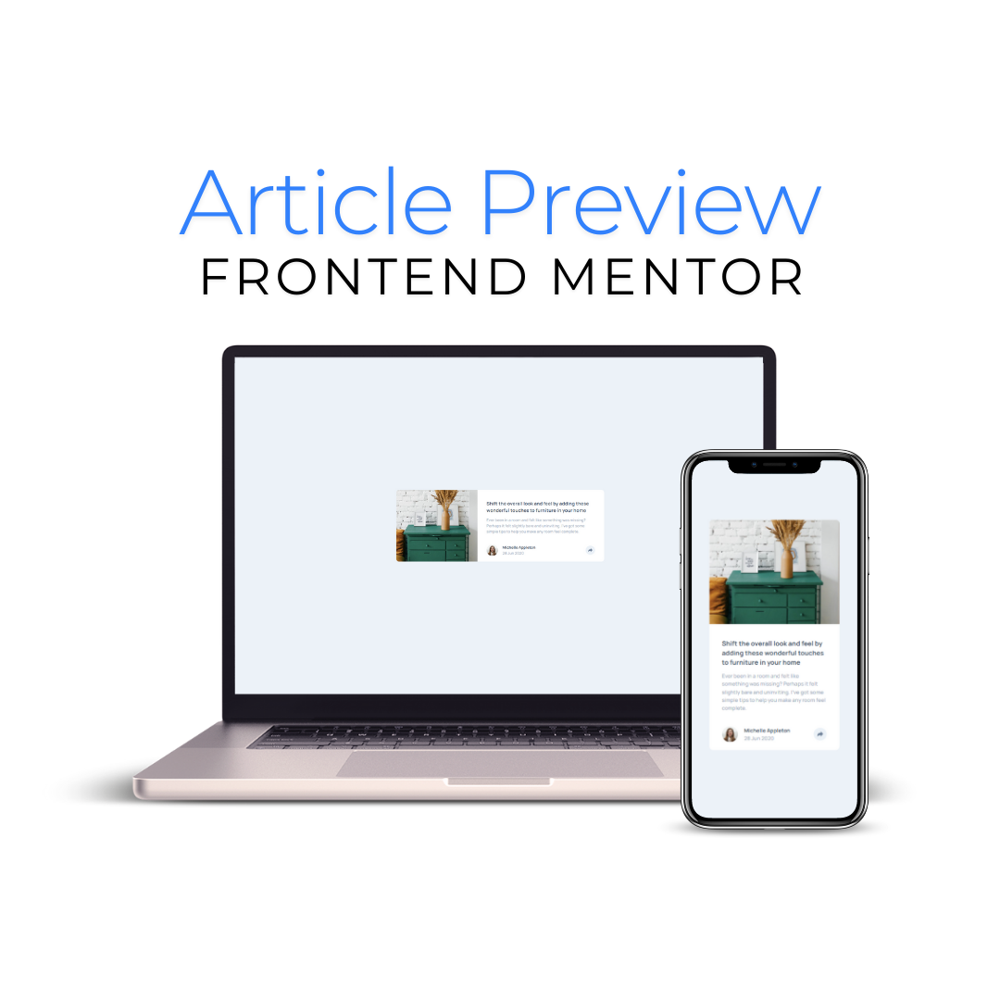

# Frontend Mentor - Article preview component solution

This is a solution to the [Article preview component challenge on Frontend Mentor](https://www.frontendmentor.io/challenges/article-preview-component-dYBN_pYFT). Frontend Mentor challenges help you improve your coding skills by building realistic projects.

## Table of contents

- [Frontend Mentor - Article preview component solution](#frontend-mentor---article-preview-component-solution)
  - [Table of contents](#table-of-contents)
  - [Overview](#overview)
    - [The challenge](#the-challenge)
    - [Screenshot](#screenshot)
    - [Links](#links)
  - [My process](#my-process)
    - [Built with](#built-with)
    - [What I learned](#what-i-learned)
    - [Continued development](#continued-development)
  - [Author](#author)
  - [Acknowledgments](#acknowledgments)

## Overview

### The challenge

Users should be able to:

- View the optimal layout for the component depending on their device's screen size
- See the social media share links when they click the share icon

### Screenshot

### Links

- Solution URL: [GitHub](https://github.com/brunagoncalves/article-preview-component)
- Live Site URL: [Live](https://brunagoncalves.github.io/article-preview-component/)

## My process

### Built with

- Semantic HTML5 markup
- CSS custom properties
- Flexbox
- CSS Grid
- Mobile-first workflow
- JavaScript

### What I learned

During the development of this project, I learned:

- How to create a responsive layout using Flexbox and CSS Grid.
- How to make interactive elements with minimal JavaScript.
- Techniques for enhancing the user experience on various devices.

### Continued development

In future iterations, I plan to:

- Add more interactivity to the component, such as animating the share options.
- Improve accessibility by ensuring better keyboard navigation.
- Optimize the component for more advanced responsiveness, such as adding animations for mobile interactions.

## Author

- Website - [brunagoncalves.me](https://brunagoncalves.me)
- Frontend Mentor - [@brunagoncalves](https://www.frontendmentor.io/profile/brunagoncalves)
- Twitter - [@BruhnaGoncalves](https://twitter.com/BruhnaGoncalves)

## Acknowledgments

Thanks to Frontend Mentor for the challenge, which is a great platform for practicing web development skills through real-world projects.
