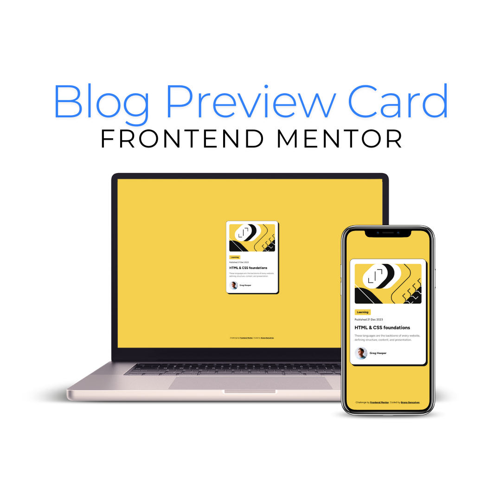

# Frontend Mentor - Blog preview card solution

This is a solution to the [Blog preview card challenge on Frontend Mentor](https://www.frontendmentor.io/challenges/blog-preview-card-ckPaj01IcS). Frontend Mentor challenges help you improve your coding skills by building realistic projects. 

## Table of contents

- [Frontend Mentor - Blog preview card solution](#frontend-mentor---blog-preview-card-solution)
  - [Table of contents](#table-of-contents)
  - [Overview](#overview)
    - [The challenge](#the-challenge)
    - [Screenshot](#screenshot)
    - [Links](#links)
  - [My process](#my-process)
    - [Built with](#built-with)
    - [What I learned](#what-i-learned)
    - [Continued development](#continued-development)
  - [Author](#author)
  - [Acknowledgments](#acknowledgments)

**Note: Delete this note and update the table of contents based on what sections you keep.**

## Overview

### The challenge

Users should be able to:

- See hover and focus states for all interactive elements on the page

### Screenshot

### Links

- Solution URL: [GitHub](https://github.com/brunagoncalves/blog-preview-card)
- Live Site URL: [brunagoncalves.me](https://brunagoncalves.github.io/blog-preview-card/)

## My process

### Built with

- Semantic HTML5 markup
- CSS custom properties
- Flexbox
- Mobile-first workflow

### What I learned

Through this project, I practiced building a responsive card component with CSS Flexbox. The project allowed me to reinforce my understanding of custom properties for colors and typography.

### Continued development

In future projects, I want to further explore more complex layouts using CSS Grid. I also aim to focus on accessibility improvements, ensuring elements have clearer focus states and are fully navigable by keyboard.

## Author

- Website - [brunagoncalves.me](https://brunagoncalves.me)
- Frontend Mentor - [@brunagoncalves](https://www.frontendmentor.io/profile/brunagoncalves)
- Twitter - [@BruhnaGoncalves](https://twitter.com/BruhnaGoncalves)

## Acknowledgments

This is where you can give a hat tip to anyone who helped you out on this project. Perhaps you worked in a team or got some inspiration from someone else's solution. This is the perfect place to give them some credit.